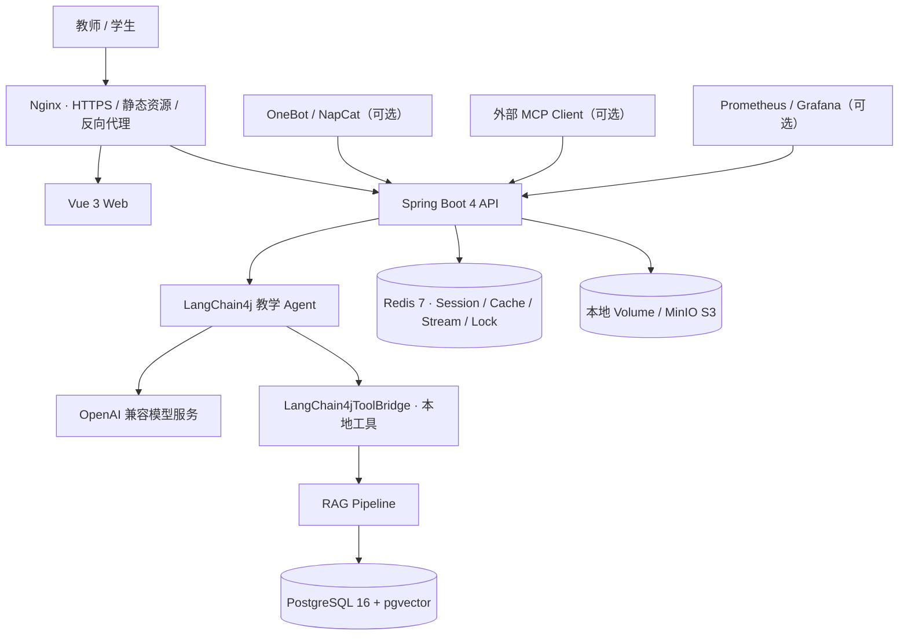

<div align="center">
  <h1>🎓 EduMind</h1>
  <p><strong>面向高校教学场景的 AI 教学助手</strong></p>
  <p>把课程知识库、智能答疑、作业批改、课堂互动与教学分析连接成一条可部署、可评估的完整链路。</p>
  <p>
    <a href="https://github.com/LKL-ZREO/EduMind/actions/workflows/ci.yml"></a>
    
    
    
    
    
  </p>
  <p>
    <a href="#核心能力">核心能力</a> ·
    <a href="#系统架构">系统架构</a> ·
    <a href="#快速开始">快速开始</a> ·
    <a href="#本地开发">本地开发</a> ·
    <a href="edumind/docs/production-deployment.md">生产部署</a>
  </p>
</div>

## 项目简介

EduMind 是一个前后端分离的智能教学平台。教师可以管理课程、班级、知识库和作业任务，学生可以提交作业并参与课堂互动；内置 AI Agent 负责知识检索、教学问答和结构化批改，教学结果最终沉淀为可追踪的数据分析。

项目不是单纯的模型 API 包装层：Embedding、混合检索、RRF 融合、Reranker、工具调用、异步批改、权限控制、评测和监控均在应用内形成了完整实现。LLM 层保持供应商中立，只需要配置一个 OpenAI 兼容端点。

## 核心能力

| 能力               | 实现                                                                                                        |
| ------------------ | ----------------------------------------------------------------------------------------------------------- |
| **内置教学 Agent** | LangChain4j Agent、会话记忆、本地工具调用、自我反思和结构化输出；直接连接可配置的 OpenAI 兼容模型服务       |
| **混合 RAG 检索**  | 本地 ONNX Embedding、pgvector 向量检索、PostgreSQL 全文检索、RRF 融合、Cross-Encoder 精排与低置信度查询改写 |
| **知识库管理**     | 文档上传、Markdown/代码/对话结构感知切块、课程级检索范围和共享知识库                                        |
| **作业与批改**     | 作业任务、学生提交、Redis Stream 异步批改、分布式锁防重复、DAG 工作流与批改轨迹                             |
| **课堂与教学数据** | 班级管理、实时课堂连接、知识点掌握度、成绩分布、错题聚合和学生成长数据                                      |
| **可选外部集成**   | OneBot/NapCat QQ 机器人，以及受 API Key 保护的 MCP JSON-RPC 端点                                            |
| **生产可运维性**   | Docker Compose、Nginx/HTTPS、PostgreSQL 自动备份、Prometheus/Grafana、结构化日志、限流与熔断                |

## 系统架构



应用自身的 Agent 直接执行本地工具，不需要经过 MCP 或外部 Agent 网关。`/mcp` 复用同一组 `ToolDefinition`，只用于可选的外部客户端集成。

### RAG 检索链路

```text
用户问题
  ├─ 本地 ONNX Embedding → pgvector 相似度检索 ─┐
  └─ PostgreSQL 全文关键词检索 ─────────────────┤
                                                  ├─ RRF 融合 → Reranker 精排 → 上下文
低置信度时：LLM Query Rewrite → 追加检索 ────────┘
```

`RagService` 是统一检索入口，Web、文档服务、OneBot 和本地 Agent 工具共享同一条检索实现。

## 快速开始

最简单的体验方式是使用 Docker Compose 完整构建前后端。此方式只要求安装 Docker Engine 与 Docker Compose plugin，不需要在宿主机安装 JDK 或 Node.js。

### 1. 获取代码

```bash
git clone https://github.com/LKL-ZREO/EduMind.git
cd EduMind/edumind
cp .env.example .env
```

### 2. 配置 `.env`

至少填写以下项目：

```dotenv
DOMAIN=localhost

DB_PASS=<数据库密码，至少 16 个字符>
LIVE_SESSION_TOKEN_SECRET=<随机密钥，至少 32 个字符>
ENCRYPT_AES_KEY=<随机密钥，至少 32 个字符>
MCP_API_KEY=<随机密钥，至少 32 个字符>

LLM_BASE_URL=https://api.deepseek.com
LLM_API_KEY=<DeepSeek API Key>
LLM_MODEL=deepseek-v4-flash
LLM_TEXT_MODEL=deepseek-v4-flash

LLM_VISION_BASE_URL=https://api.moonshot.cn/v1
LLM_VISION_API_KEY=<Moonshot API Key>
LLM_VISION_MODEL=kimi-k2.5

S3_ACCESS_KEY=<MinIO Access Key>
S3_SECRET_KEY=<MinIO Secret Key，至少 16 个字符>
GRAFANA_PASSWORD=<Grafana 管理员密码>
```

可以使用 OpenSSL 生成密钥：

```bash
openssl rand -base64 48
openssl rand -base64 32
openssl rand -hex 16
```

完整变量及说明见 [`.env.example`](edumind/.env.example)。视觉模型默认复用文本模型端点和 Key，也可以通过 `LLM_VISION_*` 单独配置。

### 3. 构建并启动

```bash
docker compose up -d --build
docker compose ps
```

启动完成后访问：

- Web：<http://localhost>
- MinIO Console：<http://127.0.0.1:9001>
- PostgreSQL、Redis、MinIO API 仅绑定在宿主机 `127.0.0.1`

首次启动会下载本地 Embedding 模型，应用健康检查的等待时间会比后续启动更长。

停止服务：

```bash
docker compose down
```

不要在需要保留数据时添加 `-v`；`docker compose down -v` 会删除数据库和文件存储卷。

## 生产部署

单机生产环境已经提供预检、前后端镜像构建、服务健康等待、Let's Encrypt 证书签发、HTTPS 切换、证书续期和 PostgreSQL 定时备份流程。

```bash
cd edumind
/bin/sh scripts/preflight.sh
/bin/sh scripts/deploy.sh
```

生产部署前必须准备域名 DNS，并只向公网开放 `80`、`443` 和受限的 SSH 端口。完整的服务器要求、配置、更新、恢复演练和排障步骤见：

> [EduMind 单机生产部署指南](edumind/docs/production-deployment.md)

## 本地开发

### 后端

```bash
cd edumind

# 先填写 .env，再启动依赖服务
docker compose up -d postgres redis minio

./mvnw spring-boot:run
```

- API：<http://localhost:8080>
- Swagger UI：<http://localhost:8080/swagger-ui.html>

### 前端

```bash
cd vue-project
npm ci
npm run dev
```

前端开发服务器运行在 <http://localhost:5173>，并将 `/api` 代理到后端 `8080`。

### 常用质量检查

```bash
# 后端
cd edumind
./mvnw test
./mvnw package -DskipTests

# 前端
cd vue-project
npm run ci:check
```

CI 会执行后端测试、Session 安全集成测试、前端格式/类型/静态检查、单元测试与生产构建。工作流见 [`.github/workflows/ci.yml`](.github/workflows/ci.yml)。

## 关键配置

| 变量                              | 用途                          | 默认/要求                         |
| --------------------------------- | ----------------------------- | --------------------------------- |
| `LLM_BASE_URL`                    | OpenAI 兼容文本模型端点       | 默认 DeepSeek                     |
| `LLM_API_KEY`                     | 文本模型 API Key              | 必填                              |
| `LLM_TEXT_MODEL` / `LLM_MODEL`    | 文本模型名                    | 默认 `deepseek-v4-flash`          |
| `LLM_VISION_*`                    | Moonshot 视觉端点、Key 与模型 | Key 必填；默认 `kimi-k2.5`        |
| `DB_PASS`                         | PostgreSQL 密码               | 至少 16 个字符                    |
| `LIVE_SESSION_TOKEN_SECRET`       | 课堂范围令牌签名密钥          | 至少 32 个字符                    |
| `ENCRYPT_AES_KEY`                 | 敏感字段加密密钥              | 至少 32 个字符                    |
| `MCP_API_KEY`                     | 外部 MCP 调用认证             | 至少 32 个字符                    |
| `STORAGE_TYPE`                    | `local` 或 `s3` 文件存储实现  | 默认 `local`                      |
| `S3_ACCESS_KEY` / `S3_SECRET_KEY` | Compose 内置 MinIO 凭据       | 必填                              |
| `RERANKER_MODEL_DIR`              | 宿主机 Reranker 模型目录      | 默认 `./models/bge-reranker-base` |
| `ONEBOT_WS_ENABLED`               | 是否连接 OneBot/NapCat        | 默认 `false`                      |
| `ENABLE_OBSERVABILITY`            | 部署脚本是否启动监控栈        | 默认 `false`                      |

Reranker 模型不是启动硬依赖。缺少 `onnx/model.onnx` 时应用会关闭精排能力，其他检索链路仍可运行。

## 可选服务

### Prometheus 与 Grafana

```bash
cd edumind
docker compose --profile observability up -d prometheus grafana
```

- Prometheus：<http://127.0.0.1:9090>
- Grafana：<http://127.0.0.1:3002>

两者只绑定本机，生产环境建议通过 SSH 隧道访问。

### OneBot / NapCat

在 `.env` 中启用：

```dotenv
ONEBOT_WS_ENABLED=true
ONEBOT_WS_URL=ws://host.docker.internal:3001
ONEBOT_WS_TOKEN=<与 NapCat 一致的随机令牌>
```

NapCat 需要单独启动。OneBot 未启用时不会影响 Web、RAG、批改或 MCP 功能。

## 技术栈

| 层级        | 技术                                                           |
| ----------- | -------------------------------------------------------------- |
| 后端        | Java 21、Spring Boot 4.0.4、Spring Security、MyBatis-Plus      |
| Agent / LLM | LangChain4j 1.15.1、OpenAI 兼容模型服务、Resilience4j          |
| 本地 AI     | DJL 0.28.0、ONNX Runtime、本地 Embedding / Reranker            |
| 数据        | PostgreSQL 16、pgvector、Flyway、Redis 7、Redisson、Caffeine   |
| 文件        | 本地 Docker Volume、MinIO / S3 兼容存储                        |
| 前端        | Vue 3.5、TypeScript 5.9、Vite 7、Element Plus、ECharts、Tiptap |
| 可观测性    | Actuator、Micrometer、Prometheus、Grafana、JSON 日志           |
| 部署        | Docker Compose、Nginx、Certbot、GitHub Actions                 |

## 项目结构

```text
EduMind/
├── edumind/                         # Spring Boot 后端与生产编排
│   ├── src/main/java/.../
│   │   ├── agent/                   # LangChain4j Agent、记忆与工作流
│   │   ├── rag/                     # 混合检索与智能切块
│   │   ├── mcp/                     # MCP JSON-RPC 与工具定义
│   │   ├── infrastructure/          # Stream、OneBot 等基础设施适配
│   │   ├── live/                    # 实时课堂
│   │   ├── eval/                    # RAG 评测
│   │   └── Controller/ Service/ ... # Web 与业务层
│   ├── src/main/resources/
│   │   ├── db/migration/            # Flyway 迁移
│   │   └── prompts/                 # Prompt 模板
│   ├── docker-compose.yml
│   ├── Dockerfile                   # 后端镜像
│   ├── Dockerfile.nginx             # Vue 构建 + Nginx 镜像
│   └── scripts/                     # 预检、部署、SSL、备份
├── vue-project/                     # Vue 3 前端
├── .github/workflows/               # CI 与部署工作流
└── docs/                            # 审查与项目文档
```

## 安全设计

- 教师端使用 Redis-backed Spring Session 与 CSRF 防护。
- 课堂学生使用独立的范围令牌，不复用教师认证会话。
- MCP 使用单独 API Key，并采用常量时间比较。
- `/api/**` 使用 Bucket4j + Redisson 分布式限流。
- LLM 调用由 Resilience4j 熔断保护。
- Nginx 仅公开 `80/443`；数据库、Redis、MinIO 和监控端口默认绑定 `127.0.0.1`。
- 生产配置启用安全 Cookie、HSTS、CSP、日志轮转和非 root 后端容器。

安全问题请不要通过公开 Issue 披露敏感细节，可先联系仓库维护者。

## 相关文档

- [后端与功能说明](edumind/README.md)
- [生产部署指南](edumind/docs/production-deployment.md)
- [迁移测试矩阵](edumind/docs/p0-migration-test-matrix.md)
- [代码质量审查记录](docs/alibaba-code-review-2026-07-13.md)

## License

MIT
